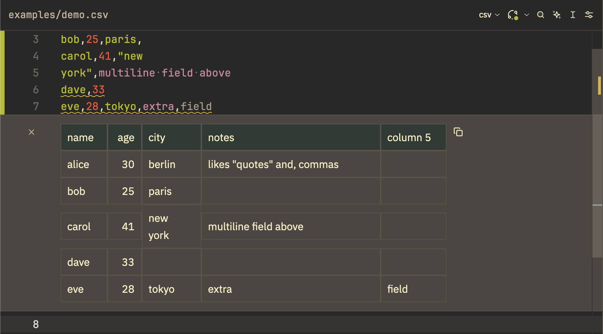
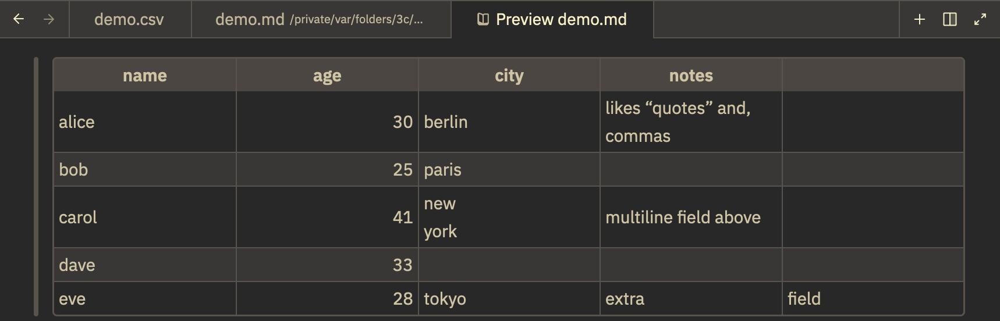

# zed-csv-toolkit

A Zed extension for delimiter-separated values — CSV, TSV, SSV (semicolon),
and PSV (pipe):

- **Rainbow columns** — each column highlighted in a cycling color.
- **Diagnostics** — ragged rows, unclosed quotes, text after a closing
  quote: the errors that silently corrupt CSVs.
- **Hover** — any cell shows its column name, column index, and row
  position — invaluable in wide files where the header is scrolled away.
- **Inline table view** — select rows, run once, see a real table rendered
  in the editor.
- **Markdown preview** — one keybinding turns the file into a markdown
  table, ready for Zed's markdown preview (wraps text, unlike the table).

Open [`examples/demo.csv`](examples/demo.csv) to see all of it at once —
it packs quoting, a multi-line field, and two ragged rows into six lines.
`csv-ls --help` lists everything the binary can do on its own.

Docs for developing, releasing, and design rationale live in
[MAINTAINER.md](MAINTAINER.md).

## Setup

Install the extension — the rest is automatic. The `csv-ls` language
server is resolved in this order: `lsp.csv-ls.binary.path` in settings, a
`csv-ls` on PATH, else downloaded from this repo's GitHub releases (and
kept up to date). `lsp.csv-ls.binary.arguments` and `.env` apply however
the binary was resolved.

For a semicolon-delimited `.csv` file, assign the buffer to the SSV
language (language selector in the status bar).

### What it writes outside Zed

The inline table view is a Jupyter kernel, so it needs four kernelspecs
(`csv`, `tsv`, `ssv`, `psv`) in your Jupyter data directory. `csv-ls`
keeps them current on every start, but only if you already have Jupyter —
an explicit `$JUPYTER_DATA_DIR`, or an existing platform data directory
(`~/Library/Jupyter`, `%APPDATA%\jupyter`, `$XDG_DATA_HOME/jupyter`). On a
machine with no Jupyter it writes nothing and says so in `zed: open log`.
No Python is involved either way: the kernel is `csv-ls` itself.

- **Enable it anyway:** run `csv-ls install-kernelspecs` once.
- **Turn it off:** `{ "lsp": { "csv-ls": { "binary": { "env":
  { "CSV_LS_NO_KERNELSPECS": "1" } } } } }` in settings.
- **Remove what it wrote:** `csv-ls uninstall-kernelspecs` (or
  `jupyter kernelspec remove csv tsv ssv psv`). Worth running before you
  uninstall the extension, or the specs linger pointing at a binary that
  is no longer there.

A kernelspec that csv-ls did not write is never overwritten or removed.

## Relationship to other CSV extensions

Two CSV extensions already exist in Zed's registry, and this one overlaps
both by design:

- [`rainbow-csv`](https://github.com/weartist/zed-rainbow-csv) ships the
  same grammar, pinned to the same commit, for the same four languages.
  The rainbow highlighting here is not an improvement on it — it is the
  same thing, bundled with the language server, because Zed has no way to
  attach a language server to another extension's languages.
- [`csv`](https://github.com/huacnlee/zed-csv) provides plain CSV syntax
  from a different grammar.

What this adds over both: diagnostics, hover, the inline table view, and
the markdown preview. Install only one of the three — Zed registers
languages by name, so two extensions defining `CSV` will fight over it.

## Inline table view

Select the rows you want (include the header; `cmd-a` for the whole file),
then `repl: run` (`ctrl-shift-enter`). Known Zed issue: the very first
run after launching Zed may silently do nothing — Zed populates its
kernel list lazily and drops the run that triggered the scan (the log
shows `No kernel found for language: CSV`); just run again. The table
renders inline (shown here alongside rainbow columns and a ragged-row
diagnostic):



`repl: clear outputs` removes it. It is read-only: column widths autosize,
long cells scroll rather than wrap, no sorting — limits of Zed's table
widget, not of this extension. Copying it yields a markdown table.

Optional one-keystroke version (extensions cannot ship keybindings, so
copy-paste; on Linux use `ctrl-a`):

```json
// keymap.json
{
  "context": "Editor && extension == csv",
  "bindings": {
    "ctrl-alt-p": ["workspace::SendKeystrokes", "cmd-a ctrl-shift-enter escape"]
  }
}
```

If several kernels exist for a language, pin ours in settings:
`{ "jupyter": { "kernel_selections": { "csv": "csv" } } }`.

## Markdown preview



`csv-ls markdown --temp <file>` writes the file as a GitHub-flavored
markdown table to a stable temp path and prints it. The path is derived
from the source file, so re-running updates the same buffer and two
same-named CSVs don't collide. Wire it to a task and a keybinding (`zed`
is Zed's CLI — `cli: install` from the command palette; the command below
is POSIX shell, so on Windows adapt it to your task shell):

```json
// tasks.json (macOS; on Linux the fallback path is
// ${XDG_DATA_HOME:-$HOME/.local/share}/zed/extensions/work/csv-toolkit/bin/csv-ls)
{
  "label": "csv: markdown preview",
  "command": "b=$(command -v csv-ls) || b=\"$HOME/Library/Application Support/Zed/extensions/work/csv-toolkit/bin/csv-ls\"; zed \"$(\"$b\" markdown --temp \"$ZED_FILE\")\"",
  "reveal": "never",
  "hide": "always"
}
```

```json
// keymap.json
{
  "context": "Editor && extension == csv",
  "bindings": {
    "cmd-shift-v": ["task::Spawn", { "task_name": "csv: markdown preview" }]
  }
}
```

`cmd-shift-v` is deliberate: it is already `markdown: open preview`'s
default binding, so pressing it in the CSV opens the markdown table, and
pressing it again in that buffer opens the rendered preview — one key,
twice. Re-running the task rewrites the same temp file and Zed reloads the
open buffer.

Gotchas: `task_name` must match the task's `label` exactly, and pick keys
your window manager doesn't capture system-wide (e.g. Amethyst may swallow
`ctrl-alt-*` chords). If the task appears to do nothing, set
`"reveal": "always"` and `"hide": "never"` to see the error.

## License

MIT. The rainbow grammar
([coroa/rainbow-csv-tree-sitter](https://github.com/coroa/rainbow-csv-tree-sitter))
is fetched by Zed from its own repository and is not vendored here.
